# Автоматизация HR-процессов внутри IT-компании
Приложение по подбору персонала внутри компании. Облегчает процесс найма внешних кандидатов и ротации уже работающий в компании сотрудников между открытыми вакансиями.

## Внешний найм
1. Кандидат извне откликается на **вакансию**
2. HR смотрит его **заявку**
3. Если кандидат соответствует **требованиям**, HR назначает кандидату **интервью** с разработчиком компании
4. Интервьюер собеседует кандидата
5. HR получает **фидбэк** от интервьюера
6. HR связывается с кандидатом и назначает следующий этап собеседования
7. Пункты 3-6 повторяются до тех пор, пока кандидат не пройдет все этапы собеседования
8. Кандидат получает **оффер**
8. Кандидат принимает оффер и выходит на раюоту в компанию

### Альтернатива
- Кандидат не удовлетворяет требованиям вакансии (у него мало опыта/нерелевантный опыт)
- Вакансия уже закрылась другим кандидатом, и ее еще не успели снять с публикации
- Кандидат плохо проходит любой этап собеседования и получает реджект
- Кандидат не принимает оффер компании

## Внутренний найм (ротация)
1. Кандидат уже работает в компании, и хочет сменить команду/направление разработки. Для осуществления ротации кандидат должен проработать в компании не менее года, и иметь положительные **оценки** за последние две аттестации
2. Кандидат заполняет **заявку** на сайте
3. HR ее смотрит
4. Если есть открытые **вакансии** в командах, соответствующие интересам кандидата, HR сообщает об этом
5. HR назначает **собеседование** с ее руководителем
6. Руководитель команды проводит собеседование
7. HR получает **фидбэк** и сообщает его кандидату
8. Кандидат меняет команду

### Альтернатива
- Кандидат не удовлетворяет требованиям для ротации (мало проработал в компании/плохие оценки за аттестации)
- В данный момент нет открытых вакансий в компании, релевантных пожеланиям кандидата
- Кандидат плохо прошел интервью
- Кандидат даже после успешного прохождения интервью передумал менять команду

# Роли
Кандидат, HR-специалист, Интервьюер (разработчик компании)

# Моделирование
В данном разделе приведены UML-диаграммы: вариантов использования, последовательности и классов.
## Диаграммы вариантов использования
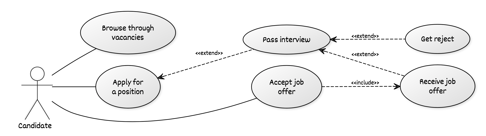
Варианты использования для кандидата

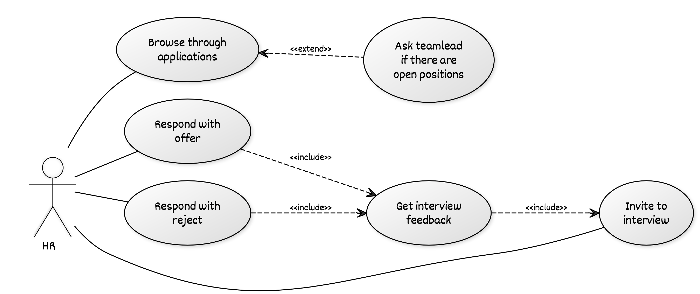
Варианты использования для рекрутера

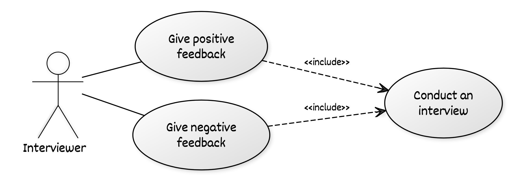
Варианты использования для интервьюера

## Диаграммы последовательности
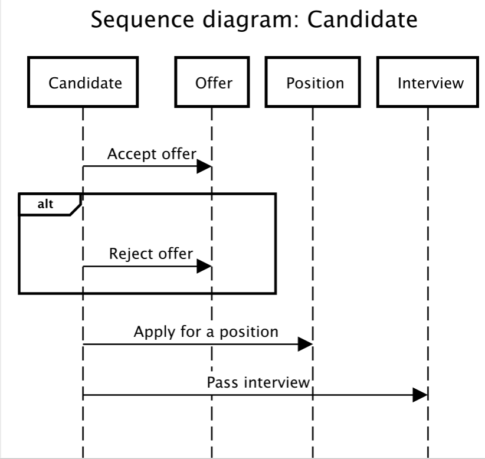 
Диаграмма последовательности для кандидата

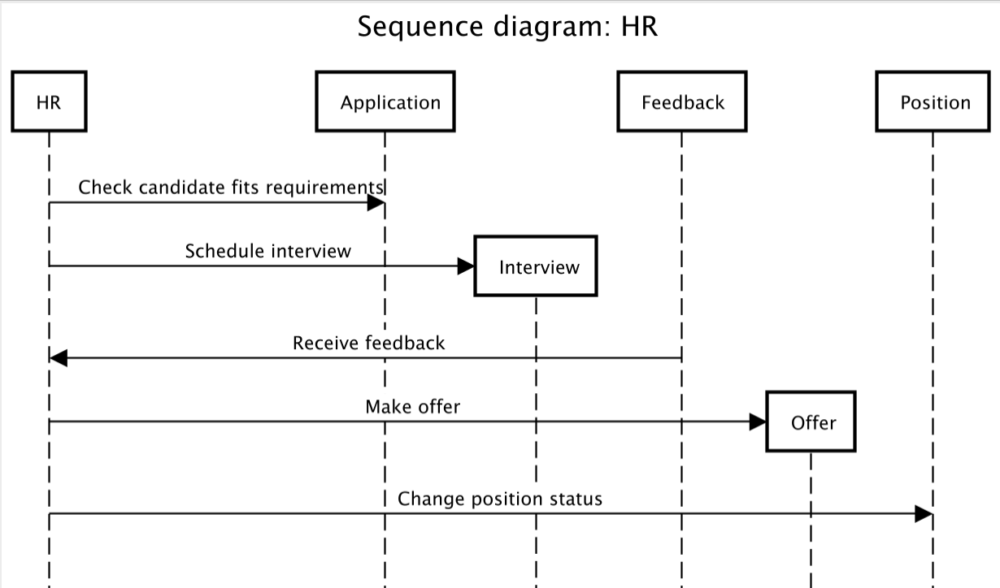
Диаграмма последовательности для рекрутера

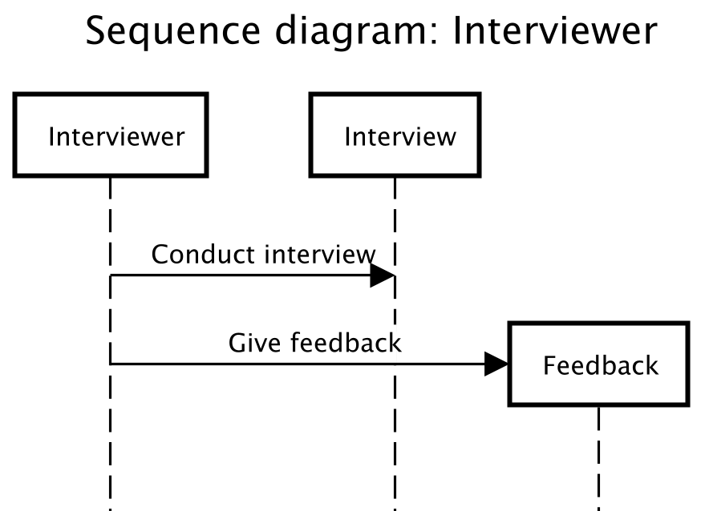
Диаграмма последовательности для интервьюера

## Диаграмма классов
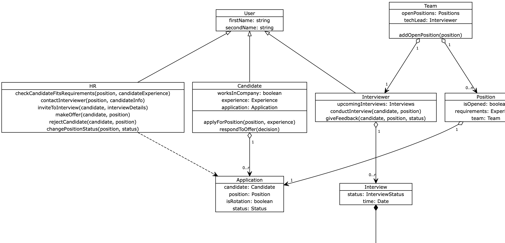

## Слой бизнес логики
Изначально за основу был взят паттерн «модель предметной области» из-за необходимости учитывать связи между объектами разных классов, однако в ходе реализации бизнес-логика была разработана по «сценарию транзакций», так как большая часть логики сосредоточилась на слое служб, а большая часть взаимодействия с объектами свелась к применению геттеров/сеттеров.

- Для уведомления о событиях, связанными с резюме/интервью всех участников процесса (кандидата, HR'а, интервьюера) используется паттерн «наблюдатель».
- Для удобного создания сущностей использован паттерн «строитель»

## Слой источников данных
Большая часть обращений к слою источников данных происходит при помощи обращения к репозиториям Spring («под капотом» используется паттерн «Отображение метаданных»)
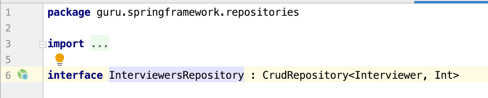
Репозиторий 

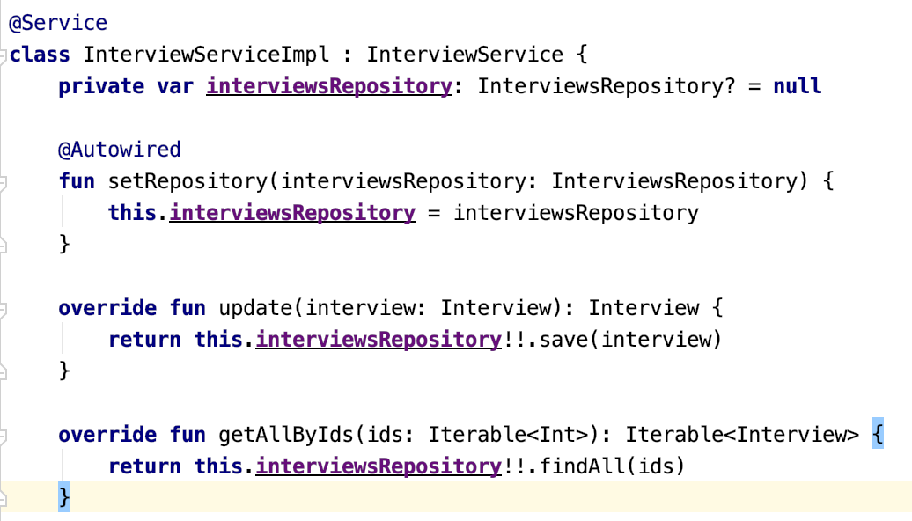
Взаимодействие с репозиторием

Для доступа к бд без использования средства фреймворка был применен паттерн «Active Record»
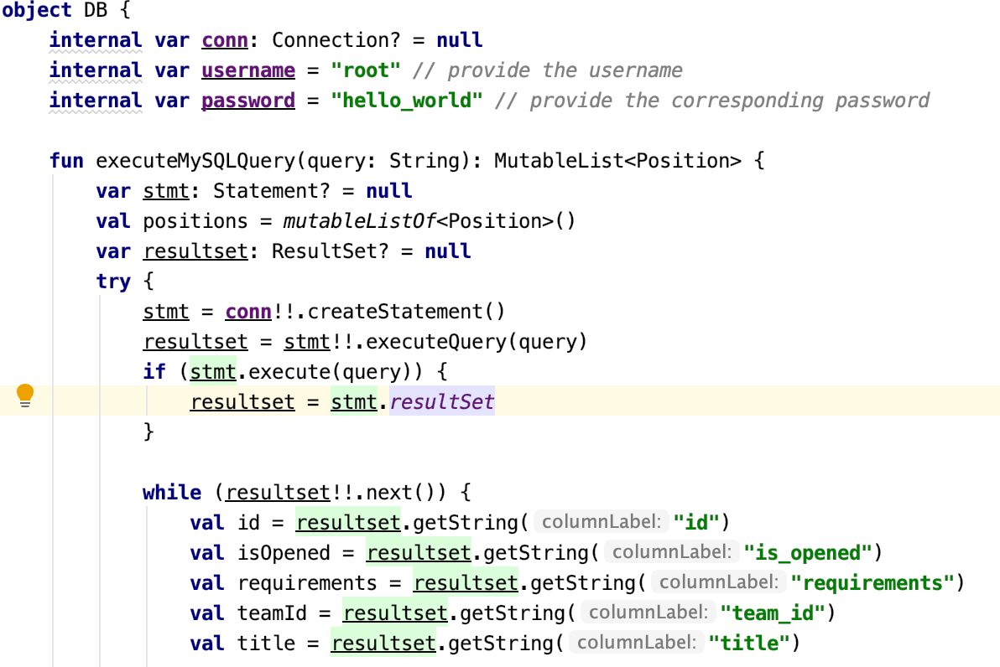
Доступ к бд

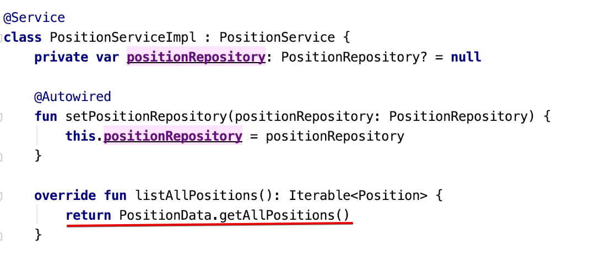
Интеграция с сервисом

# Сервисный слой
Были введены следующие сервисы
- ApplicationService - сервис работы с заявками (резюме)
- CandidateService - сервис работы с кандидатами на вакансию
- HrService - сервис HR-менеджеров
- InterviewService - сервис планирования и проведения интервью
- InterviewerService - сервис интервьюеров
- PositionService - сервис для работы с вакансиями
- TeamService - сервис для работы с командами, в которых открыты вакансии

# Слой представления
Использован подход MVC. Введены три контроллера в соответствии с ролями:
- `CandidateController`
- `HrController`
- `InterviewerController`

В этих контроллерах обрабатываются пользовательские запросы и перенаправляются нужным сервисам. 
UI реализован с помощью Thymeleaf.

# Интеграция
Взаимодействие со сторонними сервисами отсутствует. Проект оформлен в виде веб-сервиса и разворачивается в браузере по адресу http://localhost:8080/
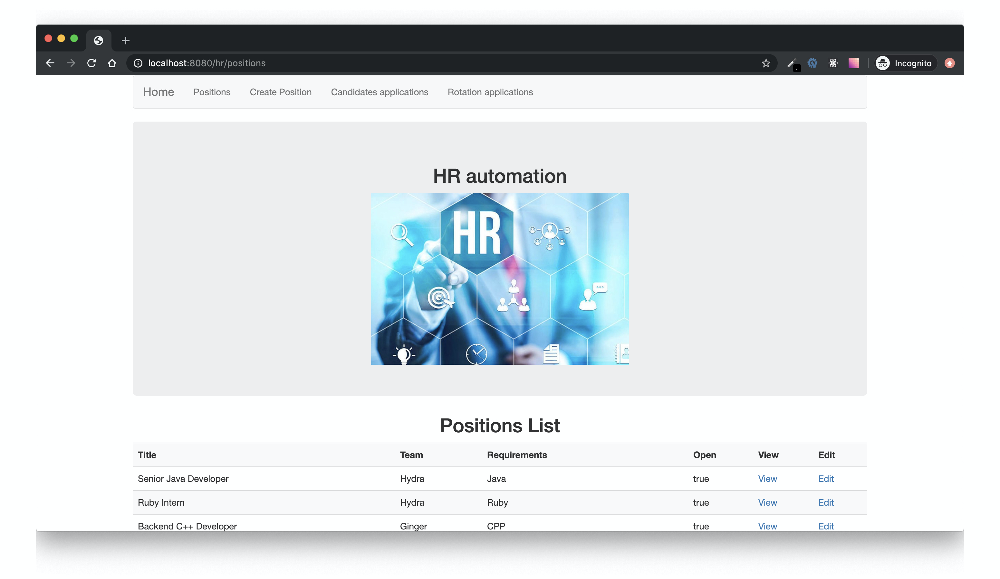

# Тестирование
Написаны unit-тесты для проверки обработки заявок соискателя в обоих бизнес-процессах, учитывающие взаимодействие со «хранилищем». Для написания автоматизированных тестов использовался JUnit4. Также проведено тщательное ручное тестирование.

# Выводы
Разработан сервис по автоматизиации hr-процессов: внешнего и внутреннего найма (ротации).
При проектировании использованы следующие паттерны: «сценарий транзакций», «строитель», «наблюдатель», «MVC». Было проведено тестирование сервиса при помощи JUnit4. Пользовательский интерфейс разработан при помощи Thymeleaf, для визуального оформления использован Bootstrap.